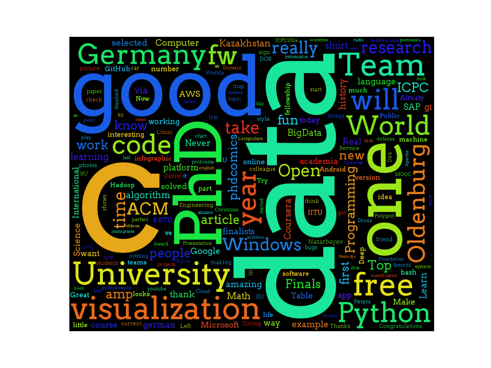
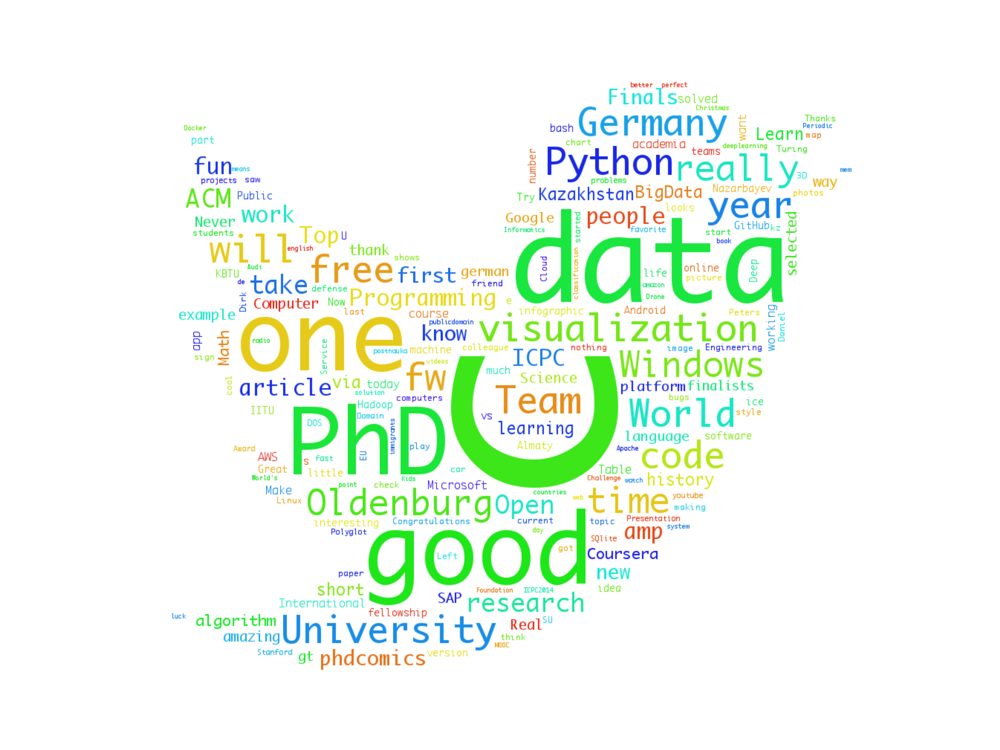

### About
Tiny python utility that converts data crawled from different services into cloud of words.

### Supported Services so Far
* [Twitter](https://twitter.com/)

### Credits
* Heavily inspired by the article [Turn Your Twitter Timeline into a Word Cloud Using Python](http://sebastianraschka.com/Articles/2014_twitter_wordcloud.html#A.-Downloading-Your-Twitter-Timeline-Tweets) written by [@rasbt](https://github.com/rasbt)
* Fonts are taken from the various of places and initially distributed by the authors under one of the open licenses. A huge collection of fonts can be found in the [googlefontdirectory github repository](https://github.com/w0ng/googlefontdirectory).

### Examples Generated





### Installation
Use 'pip' to install dependencies
```
pip instal matplotlib
pip install twitter 
pip intall pyprind
pip install numpy
pip isntall matplotlib
pip install pandas
pip isntall scipy
```

Or use 'conda' from Anaconda to install dependencies (*better solutions in case you are new to python or Windows user*):
```
conda instal matplotlib
conda install twitter 
conda intall pyprind
conda install numpy
conda isntall matplotlib
conda install pandas
conda isntall scipy
```
If you are not able to find package 'by default' with 'conda', please use 'binstar' to find proper binary of the package. For example for 'twitter' it looks like this:
```
binstar search -t conda twitter
```

Installing [wordcloud](https://github.com/amueller/word_cloud) package can be very tricky
```
pip install git+git://github.com/amueller/word_cloud.git
conda install pil
```

### Author
* [Viktor Dmitriyev](https://github.com/vdmitriyev)

###  License

Check this file with [license](LICENSE)